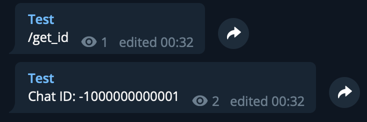

# Telegram bot `/get-id`

Bot send id: Channel, Private Channel, User or Group

Tg bot:
 - English - https://t.me/send_id_bot 
 - Русски - https://t.me/send_id_ru_bot
 
---

Example:



---

run app:

```bash
export MOD=GET_UPDATES
export BOT_TOKEN=BOK_TOKEN

go run main.go
```

run app in docker:

```bash
docker build . -t telegram-get-id
docker run --env=MOD=GET_UPDATES --env=BOT_TOKEN=BOK_TOKEN telegram-get-id 
```

---

App mode: 
 - GET_UPDATES:
```.env
MOD=GET_UPDATES
BOT_TOKEN=BOK_TOKEN
```
 - WEB_HOOK:
```.env
MOD=WEB_HOOK
BOT_TOKEN=BOK_TOKEN
APP_HOST=https://app-host/ # local: https://****.ngrok.io/
PORT=8080 # Optional 
DEBUG=true # Optional
```
